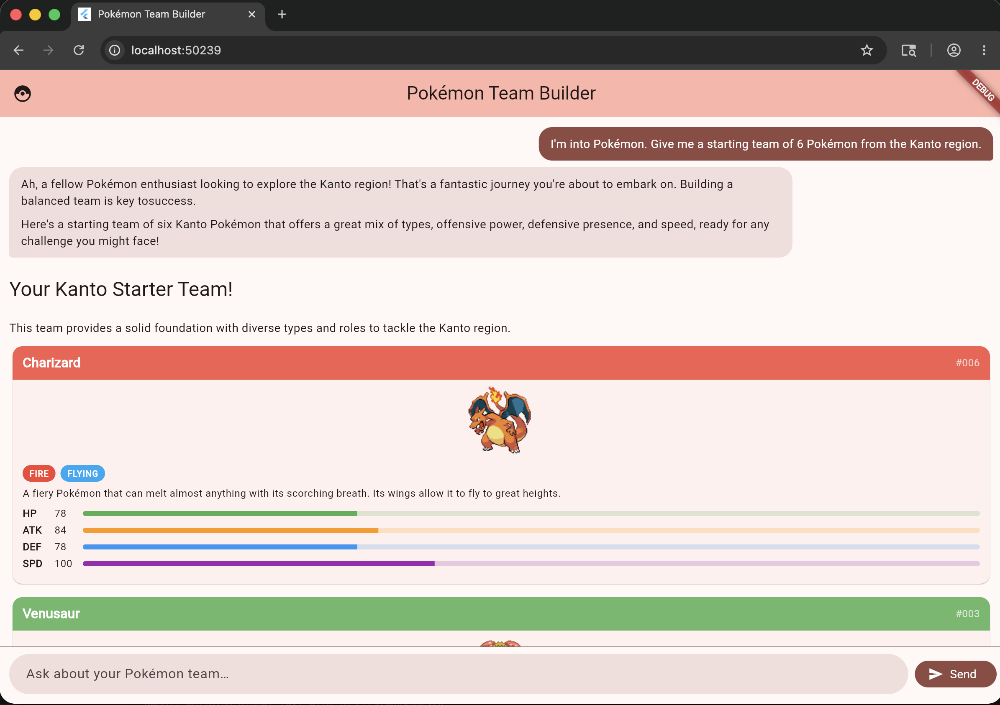
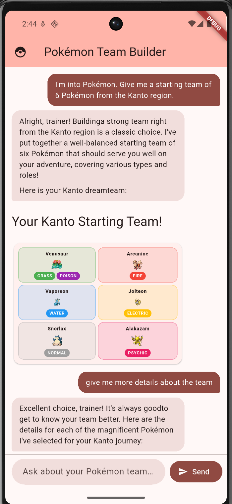

# Gen UI Pokemon Assistant

Build a team of Pokemon using Flutter GenUI with a swappable Gemini or OpenAI backend.

Based on my previous CRUD app work with PokeAPIv2 https://github.com/djmaster458/pokemon-team-builder-app 

Actively working to add richer Catalog Items such as condensed teams, move info, and trainer personality tuners to allow you to build the ultimate pokemon team.

Web
<p align="center">
   
</p>

Mobile
<p align="center">
   
</p>

## Getting Started

### Choose a backend

The app supports two AI backends selected at runtime via Dart defines.

1. `gemini` (default)
2. `openai`

### Run with Gemini

Get a Google API key from [Google AI Studio](https://aistudio.google.com/app/apikey), then run:

```bash
flutter run \
   --dart-define=AI_BACKEND=gemini \
   --dart-define=GEMINI_API_KEY=your_api_key_here \
   --dart-define=GEMINI_MODEL=gemini-2.5-flash
```

### Run with OpenAI

Get an OpenAI API key, then run:

```bash
flutter run \
   --dart-define=AI_BACKEND=openai \
   --dart-define=OPENAI_API_KEY=your_api_key_here \
   --dart-define=OPENAI_MODEL=gpt-4o-mini
```

### Supported defines

* `AI_BACKEND`: `gemini` or `openai` (default: `gemini`)
* `GEMINI_API_KEY`: required when `AI_BACKEND=gemini`
* `GEMINI_MODEL`: optional (default: `gemini-2.5-flash`)
* `OPENAI_API_KEY`: required when `AI_BACKEND=openai`
* `OPENAI_MODEL`: optional (default: `gpt-4o-mini`)
